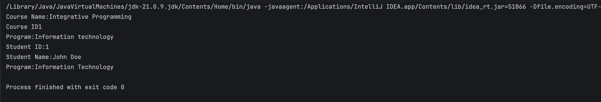

# OOP Enrollment System

---
**Author**: John Doe

**1.** Description : Encapsulation

# Inheritance

---
**Author**: Carandang James Israel

**2.** Description : Inheritance

# Abstraction

---
**Author**: Carandang James Israel

# Final Project

---
**Author**: Carandang James Israel

# Added Features

---
**Author** Carandang James Israel N.

**Added Features and Fixes**

- Fixed tuition discount formula to work with whole numbers (e.g. 10 for 10%)
- Fixed payment logic so it subtracts from balance correctly
- Added overpayment protection so balance can't go negative
- Added Department and Section management through the menu
- Students can now be enrolled into any section, not just a hardcoded one
- Added duplicate ID prevention for Students, Courses, and Instructors
- Added try-catch input validation so the program won't crash on bad input
- Added 6 JUnit tests for tuition calculation and payment
- Fixed string comparison bugs (using .equals instead of ==)
- Cleaned up display formatting for student and course lists

